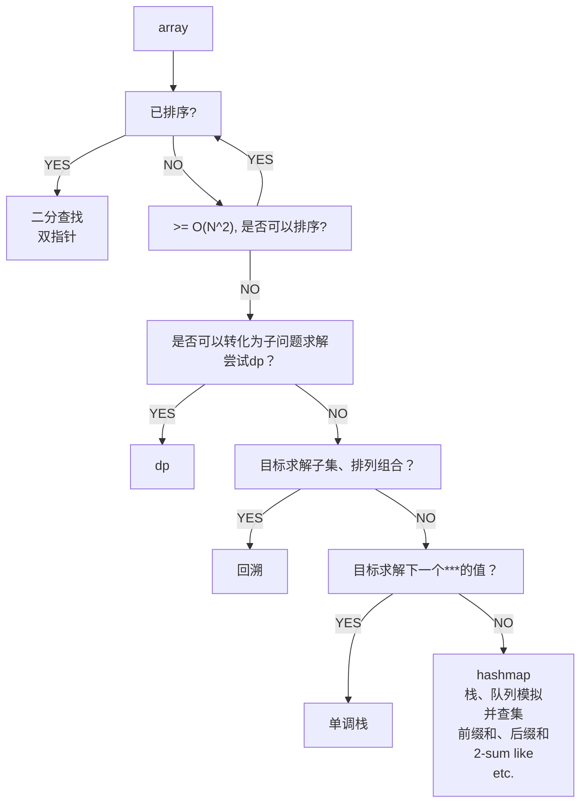

# thinking

- 享受解题的思考过程，不要为了做题而做题，不要为了赶进度而抄答案，多思考解题方式与思路，而不是单纯地刷题目数量

- LeetCode 的难度：
  - 简单，暴力可解的问题；
  - 中等，需要一个算法或数据结构优化时间、空间复杂度的题目；
  - 困难，需要两个或多个算法或数据结构组合优化时间、空间复杂度的题目

- 做题时可以先想出暴力解的思路，然后观察复杂度开销在哪里，当前题目是否有特性可以避开这个开销，再考虑如何优化。

  例如处理「链表排序」，我们知道排序算法有快排，时间复杂度为 `O(N*lgN)` ，但是因为链表查找效率为 `O(N)` ，所以该算法用于链表排序的复杂度变为 `O(N^2)` ，此时我们可以引入一个 `Map` 避免链表查找效率的开销，但这样引入了一个 `O(N)` 的空间复杂度开销。
  换一个角度，是否有有不需要索引访问，而使用顺序访问的 `O(N*lgN)` 排序算法呢？答案就只有归并排序了，但是它也引入了一个 `O(N)` 的空间复杂度。

- 涉及到 `O(N)` 空间占用的题目，考虑是否需要完整存储所有信息，还是只需要存储上一个信息即可，最典型的便是状态压缩 DP。另一种情况是，有些链表或树的题目，我们需要知道当前节点的父节点是什么，但其实我们并不需要将其转换为双向链表、带父节点引用的树，而只是需要一个 `prev` 变量记录下上一次的节点是哪个即可

- 当使用到字符串子串的时候，可以不使用 s.slice 去真的获取子串，可以使用 left、right 标记子串的左右位置，节约空间与时间。

- 二叉搜索树（BST）的中序遍历就是有序输出

- 访问数组下标时候确认没有越界

- TopK 问题中，取最大的 K 个元素，需要维护一个 K 大小的**小顶堆**，堆顶元素即为 TopK 中的最小的那个元素。需要注意的是入堆操作：
  - 堆未满：追加数据到堆尾，然后上浮到合适位置
  - 堆满时：当待插入元素大于当前堆顶元素时，使用当前元素替换堆顶数据，然后下沉堆顶元素到合适位置
  - 对于堆排序问题，堆是无限大的，所以永远当做堆未满处理即可

- TopK 用堆 `O(NlgK)` ； `the k-th` 用快排思想 `O(lgN)`

- 可以用排序解题，而且允许额外空间的情况下，记得桶排序的 `O(N)` 复杂度，例如： [https://leetcode-cn.com/problems/longest-consecutive-sequence/solution/kong-jian-huan-shi-jian-by-a-bai-155-hnm5/](https://leetcode-cn.com/problems/longest-consecutive-sequence/solution/kong-jian-huan-shi-jian-by-a-bai-155-hnm5/)

- 递归问题记得先写**终止条件**和**基础解**，再写递归的部分

- 递归的优化：剪枝、备忘录

- 链表技巧 dummyHead: 如果需要特殊处理链表的头节点，不妨设置一个新的头节点，将原头节点设置为这个新头节点的 next，这样就不需要特殊处理头节点了，但始终要记得真正的头节点是哪个，参考lt19，删除倒数第 N 个节点

- 链表常用的几个变量，prev、cur、next，参考反转链表

- 为什么分治法时间复杂度低于遍历？参考主定理结论

- 拿到算法题的步骤：1. 确定题意、边界条件 2. 用case了解题目 3. 想思路，没思路情况可以先使用暴力解，再想暴力解中可以优化的部分 4. 编码 5. 验证编码，确定边界无问题

- 单调栈很好用

- 刷题阶段不要对ad-hoc题目钻牛角尖，这种脑筋急转弯式题目对于培养解题思维无助，属于见过就会，没见过就不会的类型

- 数组类型题目容易纠结于 `<` / `<=` / `i` / `i + 1`，这种边界条件、停止条件，要构造相关用例去验证

- 数组题目两个大方向思路：1. 如果暴力解复杂度是`O(n^2)`或更高，是否可以将其排序 2. 是否可以用辅助数据结构降低时间复杂度，空间换时间

- 并查集用于判断连通性问题，图用于判断连通性和路径问题

- 图算法的根本在于图的表示方法和DFS、BFS

- 有向图最小生成树算法核心思想在于贪心选择出权值最小的边，贪心算法的理论基础为[切分定理](https://www.cnblogs.com/xiehongfeng100/p/4489711.html)。边可以用优先队列实现以便降低查询权值最小边的时间复杂度。Prime算法、Kruskal算法的区别在于两点。Prime算法通过遍历节点来获取最小生成树，并且使用遍历标记判断新引入的边是否成环；Kruskal算法通过优先队列获取最小边来获得最小生成树，并且使用并查集判断新引入的边是否成环。

- 位运算经典题目：[136. 只出现一次的数字 - 力扣（LeetCode）](https://leetcode.cn/problems/single-number/)

- 回文题目解决方案：双指针、中心扩散、翻转一半

- JS中将数字转换为无符号数: `n >>>= 0`，参考 `190-reverse-bits`

- 善用JS(>=ES2020)中的`??`，例如`const newVal = undefined ?? oldVal`最常见的场景是我们为了避免数组越界，需要检查后给特殊值，可以这样简化 `dp = []; dp[i]?.[j] ?? 0`。但是要注意，`(0 || 1) !== (0 ?? 1)` 

- 有如下几个关键词，考虑使用双指针：要求结果有序、常数空间、O(n) 时间

- 有时候，两次遍历可以有很好的效果，例如第一次从左到右遍历，第二次从右到左遍历，参考：[238. 除自身以外数组的乘积 - 力扣（LeetCode）](https://leetcode.cn/problems/product-of-array-except-self/)

- 看到题目可以先思考是否可以将问题转化为另一个问题以复用已有的算法，例如「将数组分为和相同的两半」可以转化为「从数组中取和恰好为一半的子数组」，这样就可以套用背包问题的解法了。

- 链表类问题corner case: 空链表，单节点链表，环形链表

- 可以作为其他题目思路的基础题目：2-sum（哈希表解法）、翻转数组

# 数据结构

- 数组 Array
- 链表 Linked List
- 哈希表 HashMap
- 栈、单调栈 Stack
- 队列、优先队列（堆） Queue
- 树、二叉树、搜索二叉树、前缀树（字典树）、线段树
- 图
- 并查集

# 基础算法思想

- 双指针
  - 左右指针（二分查找、接雨水）
  - 快慢指针（检测链表环）
  - 前后指针（滑动窗口的本质）
- 分治，例如归并排序
- 回溯
- 动态规划
- 二分查找
- DFS / BFS
- 状态机
- 位运算
- 数学的排列组合思想

# 特殊算法 ad-hoc

- 排序算法：插入排序、冒泡排序、快速排序、归并排序、堆排序、桶排序
- 最小生成树：Prime算法、Kruskal算法
- 最短路：[Floyd算法](https://zhuanlan.zhihu.com/p/72248451)
- 蓄水池采样 todo
- 拓扑排序
- 约瑟夫环
- 令牌桶算法

# 复杂度计算

## 主定理

# 算法决策

## 数组题目

# 不错的文章

- [我的面试题总结 - 未名空间(mitbbs.com)](http://www.mitbbs.co.nz/article_t/JobHunting/32564237.html)
- [Blind 75 - New Year Gift - Curated List of Top 75 LeetCode Questions to Save Your Time - Blind](https://www.teamblind.com/post/New-Year-Gift---Curated-List-of-Top-75-LeetCode-Questions-to-Save-Your-Time-OaM1orEU)
- [Data structures and algorithms study cheatsheets for coding interviews | Tech Interview Handbook](https://www.techinterviewhandbook.org/algorithms/study-cheatsheet/)